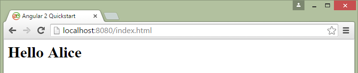
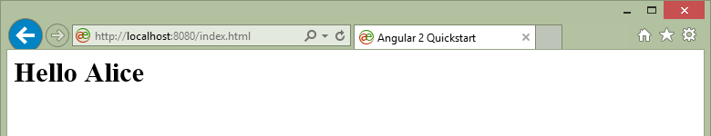
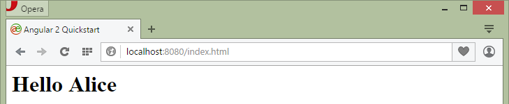

# Getting Started with TypeScript and Angular 2 on Windows

* Install [Visual Studio Code](https://code.visualstudio.com/)

* Install [Node and npm](http://blog.teamtreehouse.com/install-node-js-npm-windows)

*** Install GitHub for Windows

*** Configure Git Shell to use Windows PowerShell

## Node and npm Version

Run `node -v` and `npm -v` at the prompt in Windows PowerShell to
display the version information. A simple way to test that node.js
works is to create a JavaScript file: name it hello.js, and just add
the code `console.log('Node is installed!');`.
To run the code simply type the command `node hello.js`

```
Windows PowerShell
Copyright (C) 2014 Microsoft Corporation. All rights reserved.

PS C:\ae\aetsang> node -v
v0.12.7
PS C:\ae\aetsang> npm -v
2.11.3
PS C:\ae\aetsang> node hello.js
Node is installed!
```

## TypeScript and Angular 2

The [5 MIN QUICKSTART](https://angular.io/docs/js/latest/quickstart.html) process
is followed using newer versions of modules as needed.

Advanced information can be found on
[thoughtram](http://blog.thoughtram.io/categories/angular-2/) and the blog
from [Victor Savkin](http://victorsavkin.com/post/123555572351/writing-angular-2-in-typescript).

>*"Since TypeScript is a superset of JavaScript, you don’t need to go through a big rewrite to migrate to it. You can do it gradually, one module at a time.*

>*Just pick a module, rename the .js files into .ts, then incrementally add type annotations. When you are done with this module, pick the next one. Once the whole code base is typed, you can start tweaking the compiler settings to make it more strict.*

>*This process can take some time, but it was not a big problem for Angular 2. The fact that we could do it gradually allowed us to keep developing new functionality and fixing bugs during the transition."*

### 1. Create a project

To get the benefits of TypeScript the type definitions should be available
for the compiler and the editor. TypeScript type definitions are typically published
in a repo called [DefinitelyTyped](http://definitelytyped.org/).
To fetch one of the type definitions to the local directory, use the
[tsd package manager](https://www.npmjs.com/package/tsd).

```
$ npm install -g tsd@^0.6.0
npm WARN engine joi-assert@0.0.3: wanted: {"node":">= 0.10.0 <= 0.11.0"} (current: {"node":"0.12.7","npm":"2.11.3"})
npm WARN peerDependencies The peer dependency minichain@~0.0.1 included from minitable will no
npm WARN peerDependencies longer be automatically installed to fulfill the peerDependency
npm WARN peerDependencies in npm 3+. Your application will need to depend on it explicitly.
C:\Users\peterennis\AppData\Roaming\npm\tsd -> C:\Users\peterennis\AppData\Roaming\npm\node_modules\tsd\build\cli.js
tsd@0.6.0 C:\Users\peterennis\AppData\Roaming\npm\node_modules\tsd
├── assertion-error@1.0.0
├── deep-freeze@0.0.1
├── type-detect@0.1.2
├── joi-assert@0.0.3
├── open@0.0.5
├── rimraf@2.2.8
├── jsesc@0.5.0
├── lru-cache@2.5.2
├── ministyle@0.1.4
├── uuid@2.0.1
├── minimist@1.2.0
├── exit@0.1.2
├── json-pointer@0.2.2 (foreach@2.0.5)
├── detect-indent@0.2.0 (get-stdin@0.1.0, minimist@0.1.0)
├── miniwrite@0.1.4 (mkdirp@0.3.5)
├── minimatch@1.0.0 (sigmund@1.0.1)
├── minichain@0.0.1
├── minitable@0.0.3 (minichain@0.0.1)
├── event-stream@3.1.7 (duplexer@0.1.1, stream-combiner@0.0.4, from@0.1.3, pause-stream@0.0.11, map-stream@0.1.0, split@
0.2.10, through@2.3.8)
├── mkdirp@0.5.1 (minimist@0.0.8)
├── semver@4.3.6
├── uri-templates@0.1.7
├── bl@0.9.4 (readable-stream@1.0.33)
├── definition-header@0.1.0 (xregexp@2.0.0, parsimmon@0.5.1)
├── universal-analytics@0.3.9 (async@0.2.10, node-uuid@1.4.3, underscore@1.8.3)
├── glob@4.5.3 (inherits@2.0.1, inflight@1.0.4, once@1.3.2, minimatch@2.0.10)
├── bluebird@1.2.4
├── lazy.js@0.3.2
├── request@2.61.0 (aws-sign2@0.5.0, forever-agent@0.6.1, stringstream@0.0.4, caseless@0.11.0, tunnel-agent@0.4.1, oauth
-sign@0.8.0, isstream@0.1.2, json-stringify-safe@5.0.1, extend@3.0.0, node-uuid@1.4.3, combined-stream@1.0.5, qs@4.0.0,
form-data@1.0.0-rc3, mime-types@2.1.6, http-signature@0.11.0, bl@1.0.0, tough-cookie@2.0.0, hawk@3.1.0, har-validator@1.
8.0)
├── verror@1.4.0 (extsprintf@1.0.3)
├── joi@4.9.0 (topo@1.0.3, isemail@1.1.1, hoek@2.14.0, moment@2.10.6)
└── update-notifier@0.2.2 (is-npm@1.0.0, semver-diff@2.0.0, string-length@1.0.1, chalk@0.5.1, latest-version@1.0.1, conf
igstore@0.3.2)

$ tsd install angular2 es6-promise rx rx-lite

 - angular2    / angular2
 - es6-promise / es6-promise
 - rx          / rx-lite
 - rx          / rx

>> running install..

>> written 4 files:

    - angular2/angular2.d.ts
    - es6-promise/es6-promise.d.ts
    - rx/rx-lite.d.ts
    - rx/rx.d.ts
``` 

Next, create two empty files, index.html and app.ts, both at the root
of the project.

```
C:\ae\aetsang> touch app.ts index.html
C:\ae\aetsang> dir


    Directory: C:\ae\aetsang


Mode                LastWriteTime     Length Name
----                -------------     ------ ----
d----          9/2/2015   5:56 PM            .settings
d----          9/3/2015   5:40 PM            typings
-----          9/3/2015   5:57 PM          0 app.ts
-a---          9/3/2015   5:43 PM       3959 GettingStarted.md
-a---          9/2/2015   6:45 PM         34 hello.js
-----          9/3/2015   5:57 PM          0 index.html
```

### 2. Run the TypeScript compiler

The browser doesn't understand TypeScript code so run a compiler to
translate code to browser-compliant JavaScript. Use the TypeScript compiler in
`--watch` mode.

**NOTE:** It is also possible to do the translation in the browser as files are loaded,
or configure the editor or IDE to do it.

``` 
C:\ae\aetsang> npm install -g typescript@^1.6.0-beta
C:\Users\peterennis\AppData\Roaming\npm\tsserver -> C:\Users\peterennis\AppData\Roaming\npm\node_modules\typescript\bin\
tsserver
C:\Users\peterennis\AppData\Roaming\npm\tsc -> C:\Users\peterennis\AppData\Roaming\npm\node_modules\typescript\bin\tsc
typescript@1.6.0-beta C:\Users\peterennis\AppData\Roaming\npm\node_modules\typescript

C:\ae\aetsang> tsc --watch -m commonjs -t es5 --experimentalDecorators --emitDecoratorMetadata app.ts
message TS6042: Compilation complete. Watching for file changes.
```

### 3. Import Angular

Inside of app.ts, import the type definitions from Angular:

```
/// <reference path="typings/angular2/angular2.d.ts" />
```

Now the editor should be able to complete the available imports:

```
import {Component, View, bootstrap} from 'angular2/angular2';
```

The above import statement uses ES6 module syntax to import three symbols from
the Angular module. The module will load at runtime. 

### 4. Define a component

Components structure and represent the UI. This quickstart demonstrates the process
of creating a component that has an HTML tag named `<my-app>`. 

A component consists of two parts, the component controller which is an ES6 class,
and the decorators which tell Angular how to place the component into the page.

Add the following to app.ts: 

```
// Annotation section
@Component({
  selector: 'my-app'
})
@View({
  template: '<h1>Hello {{ name }}</h1>'
})

// Component controller
class MyAppComponent {
  name: string;
  constructor() {
    this.name = 'Alice';
  }
}
```

## 5. Bootstrap

At the bottom of app.ts, call the bootstrap() function to load the new component
into its page:

```
bootstrap(MyAppComponent);
```

The bootstrap() function takes a component as a parameter, enabling the component
(as well as any child components it contains) to render. 

### 6. Declare the HTML

Inside the head tag of index.html, include the traceur-runtime and the Angular bundle. Instantiate the my-app component in the body.

``` 
<!-- index.html -->
<html>
  <head>
    <title>Angular 2 Quickstart</title>
    <script src="https://github.jspm.io/jmcriffey/bower-traceur-runtime@0.0.87/traceur-runtime.js"></script>
    <script src="https://code.angularjs.org/2.0.0-alpha.36/angular2.dev.js"></script>
  </head>
  <body>
    <!-- The app component created in app.ts -->
    <my-app></my-app>
  </body>
</html>
```

### 7. Load the component

The last step is to load the module for the `my-app` component. To do this,
use the System library. 

>**System.js**

>[System](https://github.com/systemjs/systemjs) is a third-party open-source library that adds ES6 module loading functionality to browsers. 

Add the System.js dependency in the <head> tag of index.html

``` 
<head>
  <title>Angular 2 Quickstart</title>
  <script src="https://github.jspm.io/jmcriffey/bower-traceur-runtime@0.0.87/traceur-runtime.js"></script>
  <script src="https://jspm.io/system@0.16.js"></script>
  <script src="https://code.angularjs.org/2.0.0-alpha.36/angular2.dev.js"></script>
</head>
```

Add the following module-loading code:

```
<my-app></my-app>
<script>System.import('app');</script>
```

### 8. Run a local server

Run a local HTTP server and view the index.html file.
If needed then install an HTTP server with the following command:

```
C:\ae\aetsang> npm install -g http-server
C:\Users\peterennis\AppData\Roaming\npm\hs -> C:\Users\peterennis\AppData\Roaming\npm\node_modules\http-server\bin\http-
server
C:\Users\peterennis\AppData\Roaming\npm\http-server -> C:\Users\peterennis\AppData\Roaming\npm\node_modules\http-server\
bin\http-server
http-server@0.8.0 C:\Users\peterennis\AppData\Roaming\npm\node_modules\http-server
├── opener@1.4.1
├── corser@2.0.0
├── colors@1.0.3
├── http-proxy@1.11.2 (eventemitter3@1.1.1, requires-port@0.0.1)
├── optimist@0.6.1 (wordwrap@0.0.3, minimist@0.0.10)
├── union@0.4.4 (qs@2.3.3)
├── portfinder@0.4.0 (async@0.9.0, mkdirp@0.5.1)
└── ecstatic@0.7.6 (url-join@0.0.1, mime@1.3.4, minimist@1.2.0, he@0.5.0)
```

For example:

```
# From the directory that contains index.html:
npm install -g http-server  # Or sudo npm install -g http-server
http-server                 # Creates a server at localhost:8080
# In a browser, visit localhost:8080/index.html
```

```
C:\ae\aetsang> http-server
Starting up http-server, serving ./ on: http://0.0.0.0:8080
Hit CTRL-C to stop the server
```

**Chrome**



**Internet Explorer**



**FireFox**


**Opera**



**Safari**

Q. Why is there no example for Safari?

A. Because Apple
[discontinued](http://apple.stackexchange.com/questions/68836/where-can-i-download-safari-for-windows)
it on Windows.


